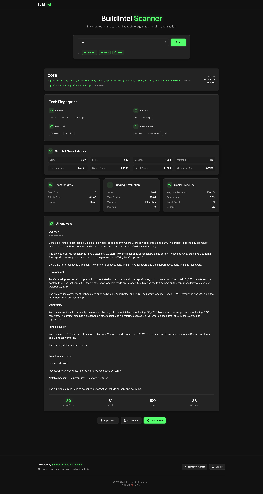

# 🧠 Build-Intel

> _Filter any on-chain or crypto project by what truly matters — traction, stack, and relevance._



---

### 🔍 What is Build-Intel?

**Build-Intel** is an open-source tool built on the sentient agent framework that helps you **analyze crypto projects or any project instantly** — giving you a quick, intelligent snapshot of:

- **Technology stack** — what the project is built with
- **Traction signals** — social, dev, and on-chain activity
- **Visibility layer** — GitHub, X (Twitter), DeFiLlama, CoinGecko integrations
- **Instant insights** — no API keys required

Whether you’re a **builder scouting ecosystem trends**, an **investor screening projects**, or just a **curious explorer**, Build-Intel gives you a **clean dashboard view** of what’s real, fast.

---

### 🧩 Features

- **Search any project name** → get full intel summary
- **Automatic tech stack inference** (frameworks, chains, protocols)
- **Traction overview** (social + developer + DeFi metrics)
- **One-click project links** (GitHub, Twitter, official site)
- **Export results** as shareable PNG snapshot
- **No setup friction** — works out of the box

---

### 🧠 Architecture

| Layer            | Description                                       |
| ---------------- | ------------------------------------------------- |
| **Frontend**     | Next.js (App Router) + Tailwind + Framer Motion   |
| **Data Sources** | DeFiLlama, CoinGecko, GitHub, X (SERPAPI), Tavily |
| **Backend**      | FastAPI (Python) with Sentient Agent Framework    |
| **Caching**      | Redis (Render)                                    |
| **Deployment**   | Vercel (frontend) + Render (backend)              |

---

### 🚀 Quick Start

#### 1️⃣ Clone & Install

```bash
git clone https://github.com/<yourname>/build-intel.git
cd build-intel
```

#### 2️⃣ Setup Frontend

```bash
cd build-intel/site
npm install
npm run dev
```

Visit `http://localhost:3000`

#### 3️⃣ Setup Backend

If you’re using the **Python FastAPI backend**:

```bash
cd backend
pip install -r requirements.txt
uvicorn main:app --reload
```

Then update your frontend `.env` with your local API endpoint.

---

### ⚙️ Environment Variables

Frontend `.env` example:

```bash
NEXT_PUBLIC_TWITTER_URL=
NEXT_PUBLIC_GITHUB_URL=
NEXT_PUBLIC_BACKEND_URL=
```

Backend `.env` example:

```bash

GITHUB_TOKEN=
TWITTER_BEARER_TOKEN=
LLM_API_KEY=
TAVILY_API_KEY=
SERPAPI_KEY=
SERPER_API_KEY=
LLM_BASE_URL=
SERP_BASE_URL=
TWITTER_API_URL=
TWITTER_BASE_URL=
TAVILY_BASE_URL=
DUCKDUCKGO_API_URL=
DEFILLAMA_API_URL=
COINGECKO_API_URL=
GITHUB_API_URL=
REDIS_URL=
LLM_MODEL=
```

---

### 🧑‍💻 Example Usage

1. Type any project name (e.g., `Zora`, `Arbitrum`, `Aave`)
2. Build-Intel fetches live metadata across DeFiLlama, CoinGecko, GitHub, and X
3. See instantly:

   - Stack
   - Developer activity
   - DeFi metrics
   - Traction signals

4. Export or share the card snapshot 🚀

---

### 💡 Future Enhancements

- 🧬 Real-time on-chain data layer
- 🗂️ Multi-project comparison view
- 🧠 LLM-based insight generation (“Explain this project”)
- 🔗 Wallet-based personalization

---

### ❤️ Contributing

Contributions, PRs, and ideas are welcome!
If you’ve built something similar or want to integrate Build-Intel with your own data source — open a PR or issue.

---

### 🧾 License

MIT License © 2025
Built with ❤️ by [@yDefiPreacherr](https://x.com/yourhandle)

---

```

```
